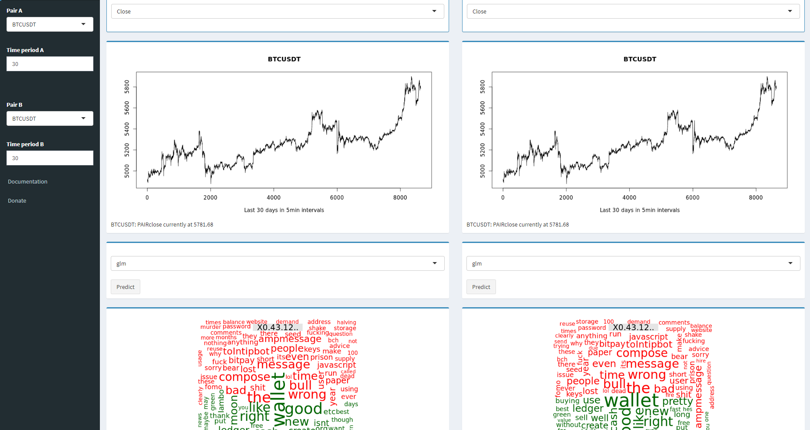

# Crypto-Dashboard

Crypto-Dashboard.net

Structure:
- Dashboard: Shiny dashboard UI and server files
- Models: dataset creation, machine learning modeling, accuracy testing
- API callers: scape data from crypto exchange APIs
- NLP: scrape data from crypto social media accounts

&nbsp;&nbsp;&nbsp;&nbsp;&nbsp;&nbsp;The ClinTrials.gov database:

</img>

contact:
vpisano@polabs.net

